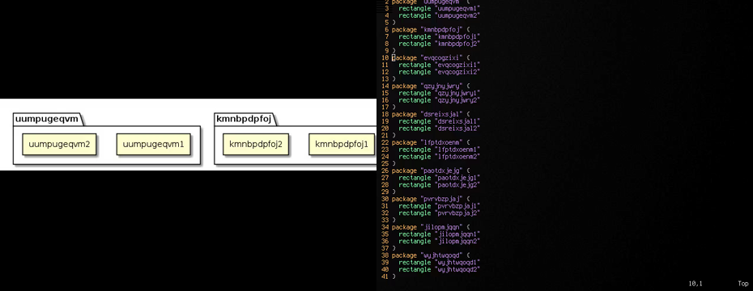

# Vim BluntUML Syntax/Plugin/FTDetect/Rendering

This project is based on [plantuml-syntax](https://github.com/aklt/plantuml-syntax).

 

## Motivation

I was looking for plugin which allows me to see and navigate diagram as I type. 
I found nothing so I decided to make this plugin.

## Naming

Why is it called BluntUML? Because underlying rendering method is quite dope.
Sequence of rendered images being pushed to `ffplay` stdin, which percieves it as 
mjpeg video stream.

## Requirements

You should have these binaries available: `plantuml`, `ffplay`, `xdotool`, `xorg-xwininfo`

## Installation

Install it as Vundle plugin to your .vimrc:

```
set rtp+=~/.vim/bundle/Vundle.vim
call vundle#begin()
Plugin 'demetrio108/bluntuml-syntax'
call vundle#end()            
filetype plugin indent on
```

## Usage

You have to map some keys to plugin functions in your .vimrc:

```
let mapleader = ','

"Render current buffer
nmap <silent> <Leader>b :exe ":silent w"<CR> :exe ":silent make"<CR><C-l>

"Move camera right
nmap <silent> ESC[1;5C :exe ":silent BluntumlMoveRight"<CR> :exe ":silent make"<CR><C-l>

"Move camera left
nmap <silent> ESC[1;5D :exe ":silent BluntumlMoveLeft"<CR> :exe ":silent make"<CR><C-l>

"Move camera up
nmap <silent> ESC[1;5A :exe ":silent BluntumlMoveUp"<CR> :exe ":silent make"<CR><C-l>

"Move camera down
nmap <silent> ESC[1;5B :exe ":silent BluntumlMoveDown"<CR> :exe ":silent make"<CR><C-l>

"Zoom out
nmap <silent> ^_ :exe ":silent BluntumlZoomOut"<CR> :exe ":silent make"<CR><C-l>

"Zoom in
nmap <silent> = :exe ":silent BluntumlZoomIn"<CR> :exe ":silent make"<CR><C-l>
```

In this exmaple instead of copying ESC sequences type them, pressing `Ctrl+v` then corresponding arrow button.
Mappings are for `Ctrl+<arrows>`
